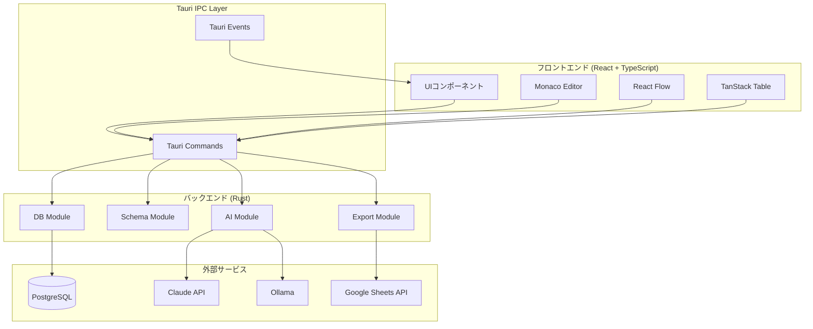
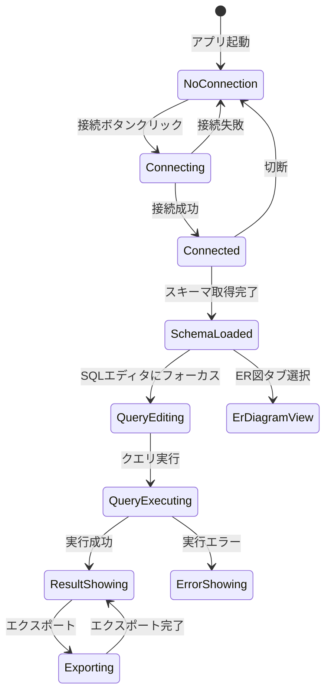
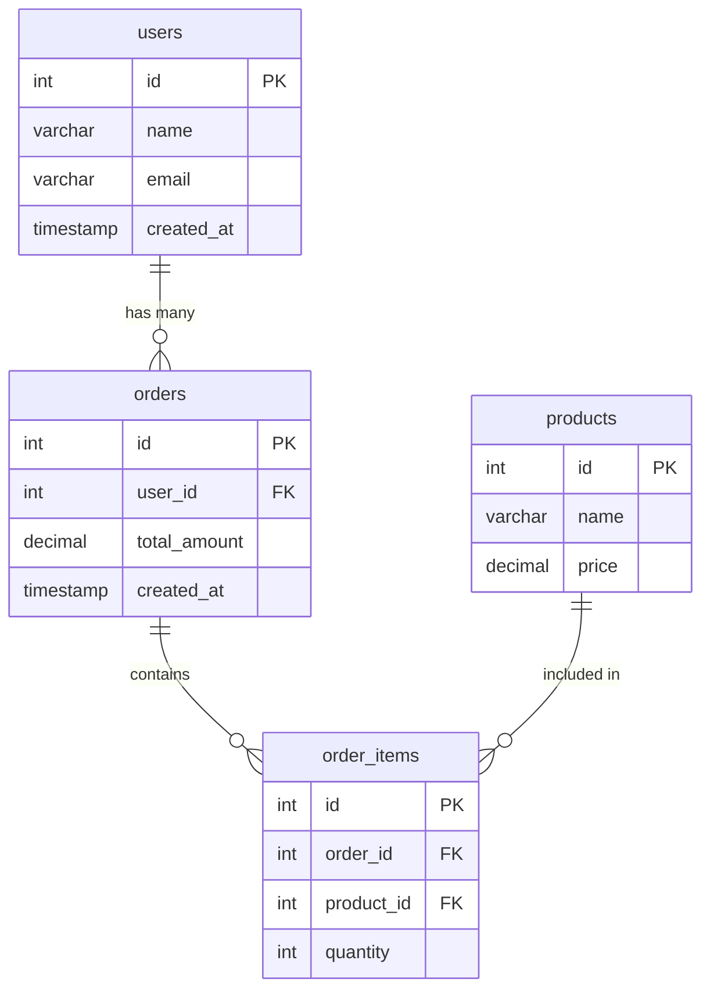
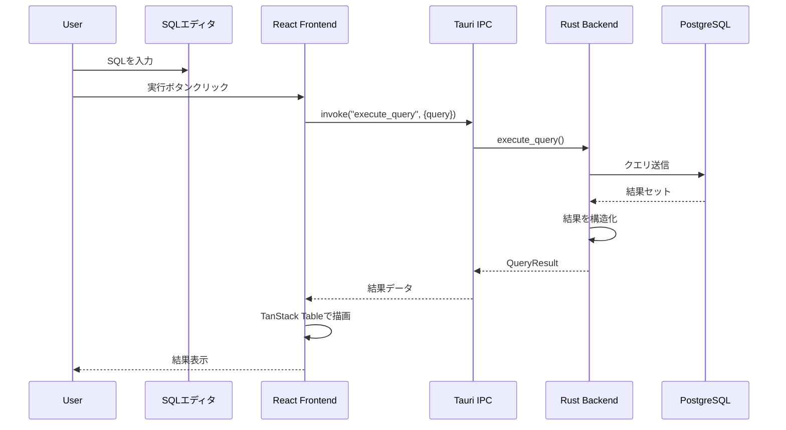
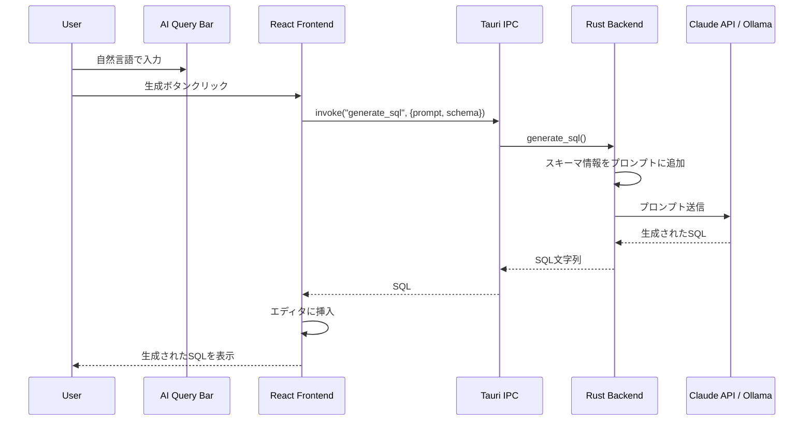

# Tablex 設計ドキュメント

## 概要

Tablexは、Rust + Tauri v2で構築する高速なデータベースクライアントアプリケーションです。PostgreSQLを初期ターゲットとし、SQLエディタ、スキーマビジュアライゼーション、AI支援機能を提供します。

### 主要な特徴

- **爆速**: Rustバックエンドによる高速なクエリ実行とレスポンス
- **軽量**: Electronと比較して大幅に軽量なTauriベース
- **AI支援**: 自然言語からSQL生成（Claude API / Ollama対応）
- **視覚的**: ER図によるリレーション可視化

---

## 目的

### なぜこの開発が必要か

1. **既存ツールの課題**
   - pgAdmin: 機能は豊富だがUIが古く、動作が重い
   - DBeaver: Java製で起動・動作が遅い
   - TablePlus: 有料版でないと機能制限がある

2. **解決したい課題**
   - 高速な起動とクエリ実行
   - モダンで直感的なUI
   - AIによるSQL生成支援で開発効率向上
   - スキーマの視覚的な理解（ER図）

3. **ターゲットユーザー**
   - バックエンドエンジニア
   - データベース管理者
   - フルスタック開発者

---

## やること（機能要件・非機能要件）

### 機能要件

#### Phase 1: 基盤構築（MVP）

| 機能 | 詳細 | 優先度 |
|------|------|--------|
| DB接続管理 | PostgreSQL接続の追加・編集・削除・テスト | 必須 |
| スキーマツリー | テーブル・カラム一覧をツリー表示 | 必須 |
| SQLエディタ | Monaco Editorベースのクエリ入力 | 必須 |
| クエリ実行 | SELECT/INSERT/UPDATE/DELETE実行と結果表示 | 必須 |
| 結果表示 | テーブル形式での結果表示 | 必須 |

#### Phase 2: 機能拡張

| 機能 | 詳細 | 優先度 |
|------|------|--------|
| ER図表示 | React Flowでテーブル間のリレーション可視化 | 高 |
| インデックス情報 | インデックス・外部キー・制約の詳細表示 | 高 |
| CSVエクスポート | クエリ結果をCSVで保存 | 高 |
| Google Sheetsエクスポート | クエリ結果をスプレッドシートに出力 | 中 |

#### Phase 3: AI機能

| 機能 | 詳細 | 優先度 |
|------|------|--------|
| 自然言語→SQL | AIによるSQL生成 | 高 |
| スキーマ認識 | 現在のDBスキーマをコンテキストに含める | 高 |
| LLMプロバイダ選択 | Claude API / Ollama切り替え | 中 |

### 非機能要件

| 項目 | 要件 |
|------|------|
| 起動時間 | 3秒以内 |
| クエリ実行応答 | 100ms以内（DB応答時間除く） |
| メモリ使用量 | 200MB以下（アイドル時） |
| 対応OS | macOS, Windows, Linux |
| セキュリティ | 接続情報の暗号化保存 |

---

## どうやるか（実装詳細）

### システムアーキテクチャ



### ディレクトリ構成

```
tablex/
├── src-tauri/
│   ├── src/
│   │   ├── main.rs              # エントリポイント
│   │   ├── lib.rs               # Tauriアプリケーション設定
│   │   ├── commands/            # Tauriコマンド
│   │   │   ├── mod.rs
│   │   │   ├── connection.rs    # 接続管理コマンド
│   │   │   ├── query.rs         # クエリ実行コマンド
│   │   │   ├── schema.rs        # スキーマ取得コマンド
│   │   │   └── export.rs        # エクスポートコマンド
│   │   ├── db/                  # データベース操作
│   │   │   ├── mod.rs
│   │   │   ├── connection.rs    # コネクション管理
│   │   │   ├── pool.rs          # コネクションプール
│   │   │   └── query.rs         # クエリ実行
│   │   ├── schema/              # スキーマ情報
│   │   │   ├── mod.rs
│   │   │   ├── tables.rs        # テーブル情報
│   │   │   ├── columns.rs       # カラム情報
│   │   │   ├── indexes.rs       # インデックス情報
│   │   │   └── relations.rs     # 外部キー情報
│   │   ├── ai/                  # AI連携
│   │   │   ├── mod.rs
│   │   │   ├── claude.rs        # Claude API
│   │   │   └── ollama.rs        # Ollama
│   │   ├── export/              # エクスポート機能
│   │   │   ├── mod.rs
│   │   │   ├── csv.rs           # CSV出力
│   │   │   └── gsheets.rs       # Google Sheets出力
│   │   ├── state/               # アプリケーション状態
│   │   │   ├── mod.rs
│   │   │   └── app_state.rs
│   │   └── error.rs             # エラー定義
│   └── Cargo.toml
├── src/
│   ├── main.tsx                 # エントリポイント
│   ├── App.tsx                  # ルートコンポーネント
│   ├── components/
│   │   ├── layout/              # レイアウト
│   │   │   ├── Sidebar.tsx
│   │   │   ├── MainPanel.tsx
│   │   │   └── StatusBar.tsx
│   │   ├── connection/          # 接続管理
│   │   │   ├── ConnectionDialog.tsx
│   │   │   └── ConnectionList.tsx
│   │   ├── schema/              # スキーマ表示
│   │   │   ├── SchemaTree.tsx
│   │   │   ├── TableNode.tsx
│   │   │   └── ColumnInfo.tsx
│   │   ├── editor/              # SQLエディタ
│   │   │   ├── SqlEditor.tsx
│   │   │   └── EditorToolbar.tsx
│   │   ├── result/              # 結果表示
│   │   │   ├── ResultGrid.tsx
│   │   │   └── ExportButtons.tsx
│   │   ├── er-diagram/          # ER図
│   │   │   ├── ErDiagram.tsx
│   │   │   ├── TableNode.tsx
│   │   │   └── RelationEdge.tsx
│   │   └── ai/                  # AI機能
│   │       ├── AiQueryBar.tsx
│   │       └── AiSettings.tsx
│   ├── hooks/                   # カスタムフック
│   │   ├── useConnection.ts
│   │   ├── useQuery.ts
│   │   ├── useSchema.ts
│   │   └── useAi.ts
│   ├── store/                   # 状態管理
│   │   ├── index.ts
│   │   ├── connectionStore.ts
│   │   └── queryStore.ts
│   ├── types/                   # 型定義
│   │   ├── connection.ts
│   │   ├── schema.ts
│   │   ├── query.ts
│   │   └── ai.ts
│   └── lib/                     # ユーティリティ
│       ├── tauri.ts             # Tauriコマンド呼び出し
│       └── utils.ts
├── docs/
│   └── DESIGN.md                # このファイル
├── package.json
├── vite.config.ts
├── tailwind.config.js
└── DEVELOPMENT.md
```

### データ構造

#### 設定ファイル

設定ファイルパス: `~/.config/tablex/config.json`

```rust
// Rust (Backend)
#[derive(Debug, Clone, Serialize, Deserialize)]
pub struct AppConfig {
    pub connections: Vec<ConnectionConfig>,
    pub ai: AiConfig,
}

#[derive(Debug, Clone, Serialize, Deserialize)]
pub struct AiConfig {
    pub provider: AiProvider,
    pub claude_api_key: Option<String>,
    pub ollama_base_url: Option<String>,  // デフォルト: http://localhost:11434
    pub ollama_model: Option<String>,     // デフォルト: llama3
}

#[derive(Debug, Clone, Serialize, Deserialize)]
pub enum AiProvider {
    Claude,
    Ollama,
    None,
}
```

```json
// 設定ファイル例
{
  "connections": [
    {
      "id": "conn_abc123",
      "name": "Local Dev",
      "host": "localhost",
      "port": 5432,
      "database": "myapp_dev",
      "username": "postgres",
      "password": "password123",
      "ssl_mode": "Disable"
    }
  ],
  "ai": {
    "provider": "Claude",
    "claude_api_key": "sk-ant-api03-xxx",
    "ollama_base_url": null,
    "ollama_model": null
  }
}
```

#### 接続情報

```typescript
// TypeScript (Frontend)
interface Connection {
  id: string;
  name: string;
  host: string;
  port: number;
  database: string;
  username: string;
  password: string;  // 暗号化して保存
  sslMode: 'disable' | 'prefer' | 'require';
}
```

```rust
// Rust (Backend)
#[derive(Debug, Clone, Serialize, Deserialize)]
pub struct ConnectionConfig {
    pub id: String,
    pub name: String,
    pub host: String,
    pub port: u16,
    pub database: String,
    pub username: String,
    #[serde(skip_serializing)]
    pub password: String,
    pub ssl_mode: SslMode,
}

#[derive(Debug, Clone, Serialize, Deserialize)]
pub enum SslMode {
    Disable,
    Prefer,
    Require,
}
```

#### スキーマ情報

```rust
#[derive(Debug, Clone, Serialize, Deserialize)]
pub struct TableInfo {
    pub schema: String,
    pub name: String,
    pub columns: Vec<ColumnInfo>,
    pub indexes: Vec<IndexInfo>,
    pub foreign_keys: Vec<ForeignKeyInfo>,
}

#[derive(Debug, Clone, Serialize, Deserialize)]
pub struct ColumnInfo {
    pub name: String,
    pub data_type: String,
    pub is_nullable: bool,
    pub is_primary_key: bool,
    pub default_value: Option<String>,
    pub comment: Option<String>,
}

#[derive(Debug, Clone, Serialize, Deserialize)]
pub struct IndexInfo {
    pub name: String,
    pub columns: Vec<String>,
    pub is_unique: bool,
    pub is_primary: bool,
}

#[derive(Debug, Clone, Serialize, Deserialize)]
pub struct ForeignKeyInfo {
    pub constraint_name: String,
    pub column: String,
    pub referenced_table: String,
    pub referenced_column: String,
}
```

#### クエリ結果

```rust
#[derive(Debug, Clone, Serialize, Deserialize)]
pub struct QueryResult {
    pub columns: Vec<ColumnMetadata>,
    pub rows: Vec<Vec<serde_json::Value>>,
    pub row_count: usize,
    pub execution_time_ms: u64,
}

#[derive(Debug, Clone, Serialize, Deserialize)]
pub struct ColumnMetadata {
    pub name: String,
    pub data_type: String,
}
```

### Tauri コマンド一覧

```rust
// 接続管理
#[tauri::command]
async fn test_connection(config: ConnectionConfig) -> Result<bool, String>;

#[tauri::command]
async fn connect(config: ConnectionConfig) -> Result<String, String>;  // 接続IDを返す

#[tauri::command]
async fn disconnect(connection_id: String) -> Result<(), String>;

// クエリ実行
#[tauri::command]
async fn execute_query(
    connection_id: String,
    query: String
) -> Result<QueryResult, String>;

// スキーマ取得
#[tauri::command]
async fn get_tables(connection_id: String) -> Result<Vec<TableInfo>, String>;

#[tauri::command]
async fn get_table_detail(
    connection_id: String,
    schema: String,
    table: String
) -> Result<TableInfo, String>;

// エクスポート
#[tauri::command]
async fn export_csv(
    result: QueryResult,
    file_path: String
) -> Result<(), String>;

#[tauri::command]
async fn export_to_sheets(
    result: QueryResult,
    spreadsheet_name: String
) -> Result<String, String>;  // スプレッドシートURLを返す

// AI
#[tauri::command]
async fn generate_sql(
    prompt: String,
    schema_context: Vec<TableInfo>,
    provider: AiProvider
) -> Result<String, String>;
```

### 画面遷移・状態遷移



### UIレイアウト詳細

```
┌─────────────────────────────────────────────────────────────────────────────┐
│  [+接続] [接続名▼]                              [⚙️設定]                    │
├─────────────────────────────────────────────────────────────────────────────┤
│  AI Query Bar                                                               │
│  ┌───────────────────────────────────────────────────────────────────────┐  │
│  │ 🤖 「先月の売上合計を顧客別に集計して」                    [生成]     │  │
│  └───────────────────────────────────────────────────────────────────────┘  │
├──────────────────────────────────────────────────────────────────────────────
│ [Tables] [Query] [ER Diagram]                                               │
├─────────────────┬───────────────────────────────────────────────────────────┤
│                 │                                                           │
│  📁 public      │  ┌─────────────────────────────────────────────────────┐  │
│  ├─📋 users     │  │ -- SQLエディタ (Monaco Editor)                      │  │
│  │  ├─ id       │  │ SELECT                                              │  │
│  │  ├─ name     │  │   u.name,                                           │  │
│  │  └─ email    │  │   SUM(o.amount) as total                            │  │
│  ├─📋 orders    │  │ FROM users u                                        │  │
│  │  ├─ id       │  │ JOIN orders o ON u.id = o.user_id                   │  │
│  │  ├─ user_id  │  │ WHERE o.created_at >= '2024-01-01'                  │  │
│  │  └─ amount   │  │ GROUP BY u.name;                                    │  │
│  └─📋 products  │  │                                                     │  │
│     ├─ id       │  └─────────────────────────────────────────────────────┘  │
│     ├─ name     │                         [▶️ 実行] [⏹️ キャンセル]         │
│     └─ price    ├───────────────────────────────────────────────────────────┤
│                 │  結果: 100行 (15ms)                    [CSV] [Sheets]     │
│  ───────────    │  ┌─────────────────────────────────────────────────────┐  │
│  📊 インデックス │  │ name      │ total      │                           │  │
│  🔗 外部キー    │  ├───────────┼────────────┤                           │  │
│                 │  │ Alice     │ 150,000    │                           │  │
│                 │  │ Bob       │ 98,500     │                           │  │
│                 │  │ Charlie   │ 75,000     │                           │  │
│                 │  └───────────┴────────────┘                           │  │
├─────────────────┴───────────────────────────────────────────────────────────┤
│  ✅ Connected to mydb@localhost:5432                          v0.1.0        │
└─────────────────────────────────────────────────────────────────────────────┘
```

### ER図描画



### シーケンス図

#### クエリ実行フロー



#### AI SQL生成フロー



### Rust依存関係

```toml
[dependencies]
# Tauri
tauri = { version = "2", features = [] }
tauri-plugin-opener = "2"
tauri-plugin-dialog = "2"  # ファイル保存ダイアログ

# 非同期ランタイム
tokio = { version = "1", features = ["full"] }

# データベース
sqlx = { version = "0.8", features = ["runtime-tokio", "postgres", "json", "chrono", "uuid"] }

# シリアライゼーション
serde = { version = "1", features = ["derive"] }
serde_json = "1"

# エラーハンドリング
anyhow = "1"
thiserror = "2"

# 日時
chrono = { version = "0.4", features = ["serde"] }

# UUID
uuid = { version = "1", features = ["v4", "serde"] }

# エクスポート
csv = "1"

# AI (後で追加)
# reqwest = { version = "0.12", features = ["json"] }

# Google Sheets (後で追加)
# google-sheets4 = "6"
# yup-oauth2 = "11"
```

### フロントエンド依存関係

```json
{
  "dependencies": {
    "react": "^19.1.0",
    "react-dom": "^19.1.0",
    "@tauri-apps/api": "^2",
    "@tauri-apps/plugin-opener": "^2",
    "@tauri-apps/plugin-dialog": "^2",
    "@monaco-editor/react": "^4.6.0",
    "@xyflow/react": "^12.0.0",
    "@tanstack/react-table": "^8.20.0",
    "zustand": "^5.0.0"
  },
  "devDependencies": {
    "tailwindcss": "^4.0.0",
    "@tailwindcss/vite": "^4.0.0"
  }
}
```

---

## やらないこと

### MVPから除外する機能

| 機能 | 理由 |
|------|------|
| 複数DB対応（MySQL, SQLite等） | PostgreSQLで安定させてから拡張 |
| クエリ履歴の永続化 | 初期リリースではセッション内のみ |
| テーブルデータの編集（INSERT/UPDATE GUI） | SQLエディタで対応 |
| マイグレーション管理 | 専用ツール（Flyway等）を使用推奨 |
| クエリの保存・管理 | Phase 2以降で検討 |
| ダークモード | Phase 2以降で検討 |
| 多言語対応 | 日本語のみで開始 |
| ショートカットキーのカスタマイズ | デフォルト設定のみ |

### 設計上の制約

- 同時接続数: 1接続のみ（複数DB同時接続は対応しない）
- 結果セット上限: 10,000行まで表示（それ以上はページング必要）
- クエリタイムアウト: 30秒（設定変更不可）

---

## 懸念事項

### 技術的な懸念

| 懸念 | 対策案 | ステータス |
|------|--------|-----------|
| 大量データ表示時のパフォーマンス | TanStack Tableの仮想スクロールを使用 | 要検証 |
| PostgreSQLの型マッピング | sqlxのサポート状況を確認、不足は手動対応 | 要調査 |
| Google Sheets OAuth認証フロー | Tauriでのブラウザ連携テストが必要 | 要検証 |
| Monaco Editorのバンドルサイズ | Web Worker分離、必要な言語のみバンドル | 要検証 |

### セキュリティの懸念

| 懸念 | 対策案 | ステータス |
|------|--------|-----------|
| 接続パスワードの保存 | ローカル設定ファイルに保存（個人利用前提）。将来的にOSキーチェーン対応を検討 | **決定済み** |
| SQLインジェクション | パラメータ化クエリの強制（表示のみなら問題なし） | 対策済み設計 |
| AI APIキーの管理 | ローカル設定ファイルに保存（個人利用前提） | **決定済み** |

### 未決定事項

1. **状態管理ライブラリ**: Zustand vs Jotai vs Redux Toolkit
   - 現時点の選択: **Zustand**（軽量、シンプル）

2. **スタイリング方式**: Tailwind CSS vs CSS Modules vs styled-components
   - 現時点の選択: **Tailwind CSS**（ユーティリティファースト）

3. **テスト戦略**:
   - バックエンド: Rustの組み込みテスト + sqlxのテストデータベース
   - フロントエンド: Vitest + React Testing Library
   - E2E: Tauri Driverを検討

---

## 参考資料・情報

### 公式ドキュメント

- [Tauri v2 Documentation](https://v2.tauri.app/)
- [sqlx - Rust SQL Toolkit](https://github.com/launchbadge/sqlx)
- [Monaco Editor for React](https://github.com/suren-atoyan/monaco-react)
- [React Flow](https://reactflow.dev/)
- [TanStack Table](https://tanstack.com/table/latest)

### 類似プロダクト参考

- [pgAdmin](https://www.pgadmin.org/) - PostgreSQL管理ツールのデファクト
- [DBeaver](https://dbeaver.io/) - マルチDB対応クライアント
- [TablePlus](https://tableplus.com/) - モダンなUIの参考

### PostgreSQL Information Schema

- [PostgreSQL System Catalogs](https://www.postgresql.org/docs/current/catalogs.html)
- [information_schema](https://www.postgresql.org/docs/current/information-schema.html)

### AI関連

- [Claude API Documentation](https://docs.anthropic.com/)
- [Ollama](https://ollama.ai/)

---

## 実装順序（推奨）

```mermaid
gantt
    title Tablex 実装フェーズ
    dateFormat X
    axisFormat %s

    section Phase 1 基盤
    パッケージ名修正           :p1-1, 0, 1
    Rust依存関係追加          :p1-2, 1, 2
    フロント依存関係追加       :p1-3, 1, 2
    基本レイアウト            :p1-4, 2, 4
    DB接続機能               :p1-5, 4, 6
    スキーマツリー表示        :p1-6, 6, 8
    SQLエディタ統合          :p1-7, 8, 10
    クエリ実行・結果表示       :p1-8, 10, 12

    section Phase 2 拡張
    ER図表示                :p2-1, 12, 15
    インデックス・制約表示    :p2-2, 15, 17
    CSVエクスポート          :p2-3, 17, 18
    Google Sheets連携        :p2-4, 18, 21

    section Phase 3 AI
    AI設定画面              :p3-1, 21, 22
    Claude API連携          :p3-2, 22, 25
    Ollama連携              :p3-3, 25, 27
    スキーマ認識SQL生成      :p3-4, 27, 30
```



---

## 変更履歴

| 日付 | バージョン | 変更内容 |
|------|-----------|---------|
| 2026-01-09 | 0.1.0 | 初版作成 |
